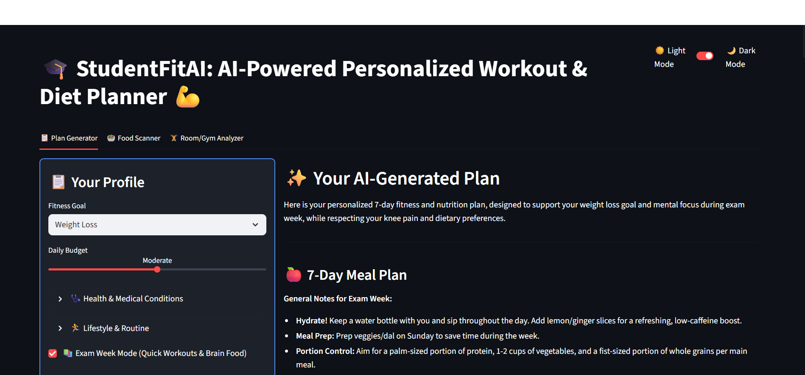
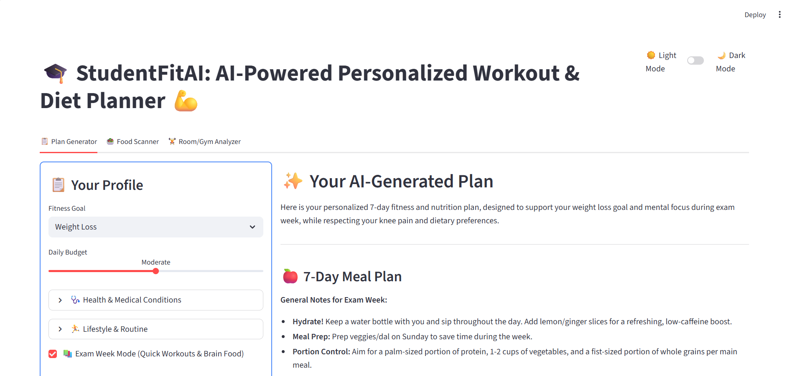
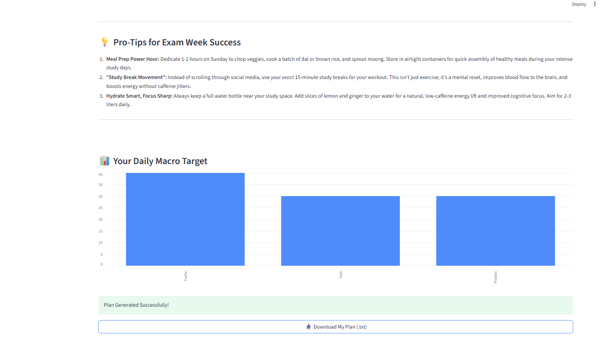
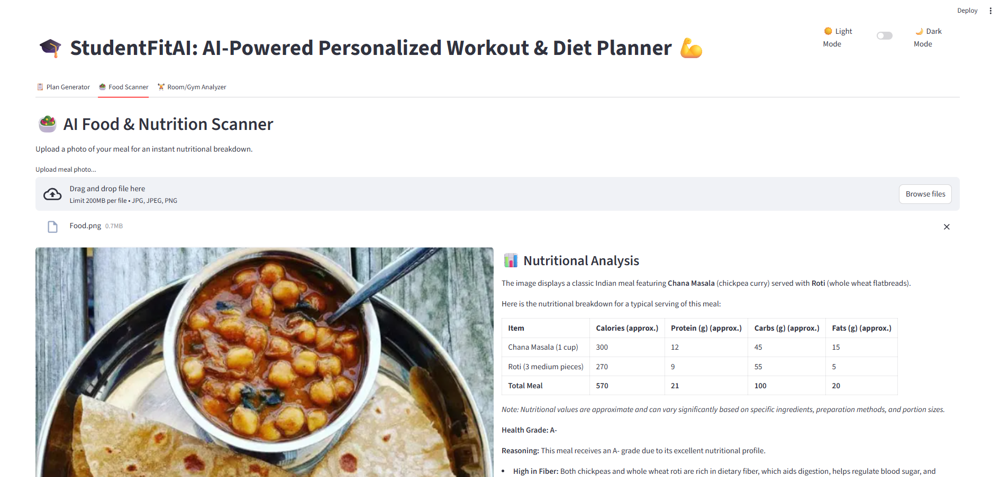
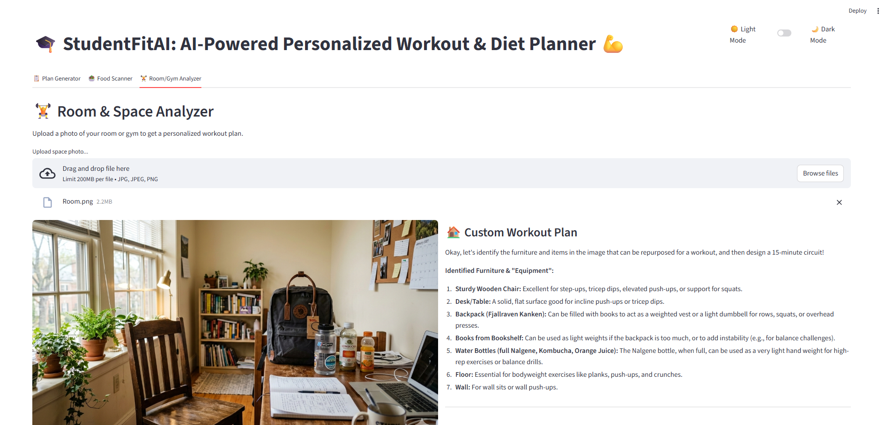

# 🎓 StudentFitAI: AI-Powered Personalized Workout & Diet Planner 💪

An AI-powered web application built with **Streamlit** and **Google Gemini** that generates personalized workout plans, diet charts, nutrition analysis, and space-based workout suggestions — all tailored specifically for students.

---

## 📸 Screenshots

### Plan Generator



### Macro Nutrient Chart & Download


### AI Food & Nutrition Scanner


### Room & Space Analyzer


---

## ✨ Features

- **📋 AI Plan Generator** — Generates a personalized 7-day meal plan, workout routine, shopping list, and pro-tips based on your fitness goal, budget, health conditions, dietary restrictions, and lifestyle.
- **📊 Macro Nutrient Chart** — Visualizes your daily protein, carbs, and fat targets in an interactive bar chart.
- **🥗 AI Food & Nutrition Scanner** — Upload a photo of your meal to get an instant nutritional breakdown (calories, protein, carbs, fats), health grade, and personalized dietary insights.
- **🏋️ Room & Gym Analyzer** — Upload a photo of your room or gym space and get a custom 15-minute workout circuit designed around the furniture and equipment visible in the image.
- **📚 Exam Week Mode** — A special mode that generates quick workouts and brain-boosting food plans optimized for study-heavy weeks.
- **🌙 Light/Dark Mode** — Toggle between light and dark themes for comfortable use at any time of day.
- **📥 Download Plans** — Export your AI-generated fitness plan, nutrition analysis, or room workout as `.txt` files.

---

## 🛠️ Tech Stack

| Technology | Purpose |
|---|---|
| Python | Core programming language |
| Streamlit | Web app UI framework |
| Google Gemini API (`gemini-2.5-flash`) | AI plan generation, food analysis, and space analysis |
| Pandas | Macronutrient data processing and charting |
| Pillow (PIL) | Image handling for food and room uploads |
| python-dotenv | Secure API key management |

---

## 📁 Project Structure

```
StudentFitAI/
│
├── app.py               # Main Streamlit application
├── requirements.txt     # Python dependencies
├── .env                 # API key (not committed to git)
├── .gitignore           # Should include .env
└── README.md            # Project documentation
```

---

## 🚀 Getting Started

### Prerequisites

- Python 3.9 or above
- A [Google Gemini API Key](https://aistudio.google.com/app/apikey)

### Installation

1. **Clone the repository**
   ```bash
   git clone https://github.com/your-username/StudentFitAI.git
   cd StudentFitAI
   ```

2. **Create and activate a virtual environment** (recommended)
   ```bash
   python -m venv venv
   source venv/bin/activate        # On Windows: venv\Scripts\activate
   ```

3. **Install dependencies**
   ```bash
   pip install -r requirements.txt
   ```

4. **Set up your API key**

   Create a `.env` file in the root directory:
   ```
   GEMINI_API_KEY=your_google_gemini_api_key_here
   ```

5. **Run the app**
   ```bash
   streamlit run app.py
   ```

6. Open your browser and go to `http://localhost:8501`

---

## 🧭 How to Use

### Tab 1 — Plan Generator
1. Fill in your **Fitness Goal**, **Daily Budget**, health conditions, dietary restrictions, and lifestyle details.
2. Optionally enable **Exam Week Mode** for quick workouts and brain food.
3. Click **Generate My Plan** to get your personalized 7-day meal plan, workout routine, shopping list, macro chart, and pro-tips.
4. Download the plan as a `.txt` file.

### Tab 2 — Food Scanner
1. Upload a photo of your meal (JPG, JPEG, or PNG).
2. Click **Analyze Nutrition** to get a full nutritional breakdown, health grade, and personalized suggestions.
3. Save the analysis as a `.txt` file.

### Tab 3 — Room/Gym Analyzer
1. Upload a photo of your room or gym space.
2. Click **Find My Workout** to receive a custom 15-minute circuit workout based on the furniture and equipment in your photo.
3. Save the workout as a `.txt` file.

---

## ⚙️ Configuration

The app reads the following environment variable from a `.env` file:

| Variable | Description |
|---|---|
| `GEMINI_API_KEY` | Your Google Gemini API key |

> ⚠️ Never commit your `.env` file to version control. Add it to `.gitignore`.

---

## 📦 Dependencies

Key packages used (see `requirements.txt` for full list):

- `streamlit` — UI framework
- `google-generativeai` — Gemini AI integration
- `pandas` — Data manipulation for macro charts
- `pillow` — Image processing
- `python-dotenv` — Environment variable management

---

## 🤝 Contributing

Contributions, issues, and feature requests are welcome! Feel free to open an issue or submit a pull request.

---

## 🙋‍♂️ Author

Developed by [Srija Ghosh](https://github.com/Srija-Ghosh-05) as part of an AI & ML Internship at Edunet Foundation.